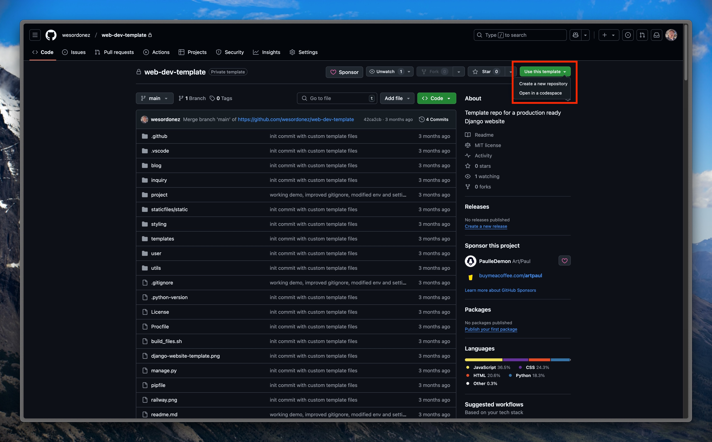
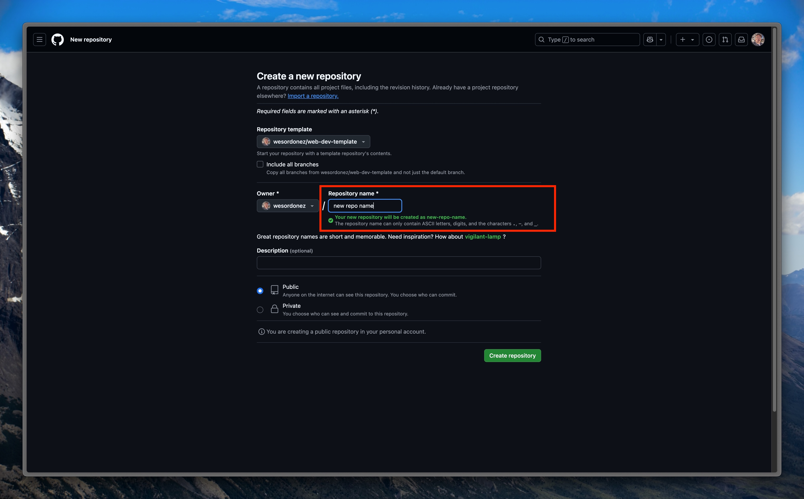

# How to Create a New Django Web Dev Project

This is a guide to how to create a new Django based web dev project in Dunosis using templates. This is the main process that should be used with new client projects to ensure they are consistent. Follow these steps:

## 1. Create a New GitHub Repo

Use the [**Django Web Dev Template Repo**](https://github.com/wesordonez/web-dev-template) as a starting point for the new project.

### There are 2 Options for Creating the Repository:

**Option 1: Navigate to the template repository**:

   Click the **"Use this template"** button and follow the prompts to create a new repository.
   

**Option 2: Create a new repository**:

   During creation, select **web-dev-template** from the list of templates provided by GitHub.
   

## 2. Clone the Repository to Your Local Machine

```bash
git clone <REPO_URL>
```

## 3. Create Virtual Environment and Activate

```bash
python3 -m -venv venv
source venv/bin/activate
```

## 4. Install Dependencies and Packages

```bash
pip install -r requirements.txt
```

## 5. Set Environment Variables

Use the template `.env.dev` file to create environment variables. Most importantly, define the `SQL_NAME` variable in order to connect to the postgres development database. 

!!! tip

    The `SECRET_KEY` variable is not required at this stage but will be shortly. 

## 6. Create Database

In PGAdmin 4 create a new database with the same name as the enviornment variable `SQL_NAME`. Ensure configuration of database is also in-line with credentials defined in the other environment variables. 

## 7. Connect and Create Database Tables

The django template will create all the necessary tables in the database by running:

```py
python manage.py migrate
```

!!! danger "IMPORTANT!!"
    This step is crucial and must be done before any other initiation commands such as `runserver` since it defines the migration history. In case that other commands are run prior and the migration history is messed up, the fatal error can only be fixed by starting process over again and reinstalling django. 

## 8. Change SECRET_KEY

Now, you can change the `SECRET_KEY` variable in the `.env` file with the generated key that should have been output by the previous `migrate` command. The `PROD_SECRET_KEY` should be a different variable defined during the deployment stage. 

Next, comment out the line in the `settings.py` file that generates secret keys: 

```py linenums="46" hl_lines="2"
# SECURITY WARNING: Delete this line after setting up the environment variables
# print(f"SECRET KEY:", get_random_secret_key())
```

## 9. Start the Django Server and Test

All that's left to do is run the django server and test the newly create project to ensure everything is functioning as expected. 

```py
python manage.py runserver
```

Access the development server in a browser by navigating to `localhost:8000/`. If everything was done correctly you should be greated with the template homepage with a functional navbar that leads to a about, blog, and contact page.

From here, it's a good idea to also test the connection to the database by navigating to the contact page and filling out the form with test or dummy data and confirming the data was persisted in the database. 

## 10. **Optional:** Connect Repo to Sourcery AI

In the permissions section of the repo, add the new project to Sourcery AI and activate it through the web portal for automated AI generated code reviews on Pull Requests. 
